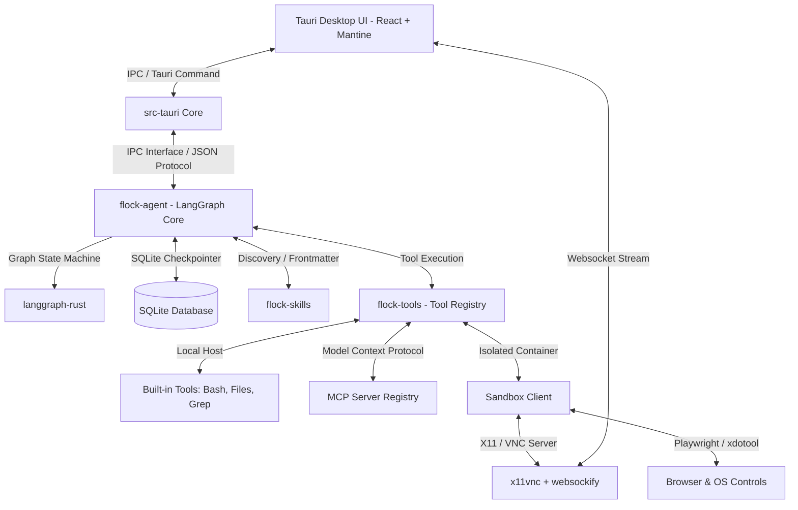

# Flock

A desktop multi-agent harness built with Rust, Tauri, and React, powered by langgraph-rust.

**Visual Workflow | Multi-Agent Harness | Built-in Agent | Safe Sandbox & VNC | Cross-Platform | Any API Key**

English | [简体中文](docs/README_zh.md)


> **Note**: This project is built on top of [langgraph-rust](https://github.com/Onelevenvy/langgraph-rust), which is my personal Rust implementation of the LangGraph framework.
>
> **Refactoring History**: Flock has been completely rewritten from the ground up. The original version was a Python-based application using LangGraph, LangChain, and FastAPI as the backend. The current version is a native desktop application with a Rust backend, powered by Tauri for the desktop shell. This rewrite brings significant improvements in performance, reliability, and user experience.
> 
> **Legacy Code**: The original Python codebase is preserved in the `legacy/python` branch for reference.

---

## 📋 Quick Navigation

[Multi-Agent Harness & Workflow](#-multi-agent-harness--workflow) · [Core Features](#-core-features) · [Architecture](#-architecture) · [Quick Start](#-quick-start)

---

## 🤝 Multi-Agent Harness & Workflow — Visual Orchestration for AI Agents

Flock is more than just a chat client. It's a comprehensive **multi-agent harness** combined with a powerful **Visual Workflow Editor**. It orchestrates and runs AI agents locally or inside sandbox containers to read/write files, execute bash commands, browse the web, and run complex pipelines. You see everything the agent does, and you're always in control.

| Capability / Feature | Traditional Chat Clients | Flock (Multi-Agent Harness) |
| :--- | :---: | :---: |
| **Visual Workflow Builder** | No | **Yes** — ReactFlow editor with 10+ node types & streaming execution |
| **AI Operating on Files** | Limited or No | **Yes** — Built-in agent with full filesystem, grep, and glob access |
| **Multi-Step Autonomy** | No | **Yes** — Autonomous LangGraph-rust execution loop with approval prompts |
| **Scheduled Task Automation** | No | **Yes** — Native Cron scheduler for 24/7 unattended workflows |
| **Multi-Agent Collaboration** | No | **Yes** — Auto-detects & orchestrates multiple agents in team networks |
| **Open Source & Extensible** | Rarely | **Yes** — Free, built with Rust & Tauri, fully extensible |

---

## 🌟 Core Features

### 🕸️ Visual Workflow Editor (ReactFlow Engine)
* **Drag-and-Drop Canvas**: Design complex pipelines visually by connecting custom agent and logic nodes.
* **10 Node Types Shipped**:
  * `start` & `answer`: Define workflow inputs and final delivery parameters.
  * `llm` & `agent`: Pure inference nodes and tool-enabled LangGraph agents.
  * `classifier` & `ifelse`: Semantic routing routers and conditional branch checkers.
  * `code`: Custom JS/Python code runners to execute arbitrary transformations.
  * `human`: Interactive interrupts asking for manual feedback or input.
  * `plugin` & `parameter_extractor`: Expose custom tools/plugins and extract structured data.
* **Version Control & Execution History**: Easily manage multiple versions of your visual workflows, track historical execution paths, and debug states incrementally.

### 👥 Human-in-the-Loop (HITL) & Safe Interaction
* **Interactive Tool Approvals**: Crucial actions (like writing files, running bash scripts, or modifying configurations) require explicit user approval before execution. You can inspect the plan, approve, or deny on the fly.
* **VNC Screen Takeover**: Directly interact with sandboxed browser and OS interfaces. When the agent gets stuck on captchas, you can take over mouse/keyboard controls seamlessly.
* **Workflow Breakpoints (`human` node)**: Place manual intervention checkpoints in the visual flow to request human decisions, form submissions, or variable modifications before proceeding.

### 🌐 Browser Automation & Computer Use
* **Playwright Browser**: Scrape web data, click links, and bypass forms using an isolated browser execution engine.
* **Computer Use**: Command virtual desktops using OS-level commands (`xdotool`). The agent monitors framebuffer screen feeds and handles mouse/keyboard events.

### 🤖 Built-in Agent — Zero Configuration
* **Out of the box**: No external CLI tools to download or configure. Paste any API Key (OpenAI, Gemini, Anthropic Claude, AWS Bedrock, or Ollama/local) and start immediately.
* **Skill Extensions**: Extensible via YAML-frontmatter prompts that support Hot-Reloading on file changes.

### 🔒 Safe Sandbox Environment
* **Isolated Environment**: Executes risky shell scripts and code execution safely inside isolated environment containers.
* **VNC Streaming**: Stream sandbox desktops directly into the UI via WebSockets for full visual inspection of the running environment.

### 🔌 MCP & Scheduled Tasks
* **MCP (Model Context Protocol)**: Connect to third-party MCP servers once; all assistants and workflows automatically inherit the newly exposed schemas and tools.
* **Scheduled Cron Tasks**: Set it once, the agent executes scheduled tasks on autopilot. Supports standard cron syntax for automated system maintenance, daily file aggregation, or report generation.

---

## 🏗️ Architecture



### Module Breakdown

| Crate | Directory | Purpose |
|-------|-----------|---------|
| `flock-core` | `crates/flock-core` | Shared configuration schemas, SQLite DB models, encryption utilities, and IPC channels. |
| `flock-agent` | `crates/flock-agent` | The core agent executor loop, LangGraph state engine, checkpointer, and memory system. |
| `flock-workflow`| `crates/flock-workflow` | Workflow node logic and JSON-to-LangGraph AST compiler. |
| `flock-tools` | `crates/flock-tools` | Built-in and sandboxed tools, VNC web socket proxies, and sandbox managers. |
| `flock-skills` | `crates/flock-skills` | System prompts loader supporting variable injection and watcher-based hot-reload. |
| `flock-ui` | `flock-ui` | React application featuring Zustand, i18next, and ReactFlow editor. |

---

## 🚀 Quick Start

### Prerequisites
* **Rust**: `1.77.2` or later
* **Node.js**: `18.x` or later

### Install & Run

1. **Clone the Repository**
   ```bash
   git clone https://github.com/Onelevenvy/flock.git
   cd flock
   ```

2. **Install Frontend Dependencies**
   ```bash
   cd flock-ui
   npm install
   ```

3. **Start Development App**
   ```bash
   npm run tauri dev
   ```

4. **Run Backend Tests**
   ```bash
   cargo test --workspace
   ```

---

## 📄 License

Licensed under the Apache License, Version 2.0. See [LICENSE](LICENSE) for details.
