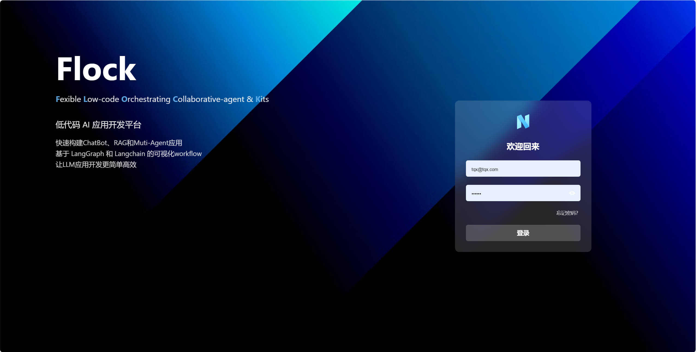

## 📃 Flock (Flexible Low-code Orchestrating Collaborative-agent Kits)

<p align="center">
  <a href="./README_cn.md">简体中文</a> |
  <a href="./README.md">English</a> |
  <a href="./README_ja.md">日本語</a> |
  <a href="./README_cn.md#如何开始">快速开始</a>
</p>

> [!TIP]
> ### 🎉 最新更新
> **CrewAI 节点支持**: 现在您可以在工作流中使用 CrewAI 的强大多代理功能！轻松创建复杂的代理团队并编排复杂的协作任务。

一个基于 LangChain、LangGraph 和其他框架的聊天机器人、RAG、代理和多代理应用项目，开源且能够离线部署。
<video src="https://private-user-images.githubusercontent.com/49232224/374006908-309ab01e-8a29-4764-b470-dbedea8d8622.mp4?jwt=eyJhbGciOiJIUzI1NiIsInR5cCI6IkpXVCJ9.eyJpc3MiOiJnaXRodWIuY29tIiwiYXVkIjoicmF3LmdpdGh1YnVzZXJjb250ZW50LmNvbSIsImtleSI6ImtleTUiLCJleHAiOjE3MjgyNjg4MzEsIm5iZiI6MTcyODI2ODUzMSwicGF0aCI6Ii80OTIzMjIyNC8zNzQwMDY5MDgtMzA5YWIwMWUtOGEyOS00NzY0LWI0NzAtZGJlZGVhOGQ4NjIyLm1wND9YLUFtei1BbGdvcml0aG09QVdTNC1ITUFDLVNIQTI1NiZYLUFtei1DcmVkZW50aWFsPUFLSUFWQ09EWUxTQTUzUFFLNFpBJTJGMjAyNDEwMDclMkZ1cy1lYXN0LTElMkZzMyUyRmF3czRfcmVxdWVzdCZYLUFtei1EYXRlPTIwMjQxMDA3VDAyMzUzMVomWC1BbXotRXhwaXJlcz0zMDAmWC1BbXotU2lnbmF0dXJlPTJiMGZiZjU3MGIyMWZkZDRkNjI3MmU5MzA1YTZhNmRlODVkZTcxYWI1MjYxMGM2ODU0NzM3OWVkN2MxNTk2MmEmWC1BbXotU2lnbmVkSGVhZGVycz1ob3N0In0.j-kXuux_wfe2bK2VW77TY53mTqj9iYn7kyuxwwwNQQw" data-canonical-src="https://private-user-images.githubusercontent.com/49232224/374006908-309ab01e-8a29-4764-b470-dbedea8d8622.mp4?jwt=eyJhbGciOiJIUzI1NiIsInR5cCI6IkpXVCJ9.eyJpc3MiOiJnaXRodWIuY29tIiwiYXVkIjoicmF3LmdpdGh1YnVzZXJjb250ZW50LmNvbSIsImtleSI6ImtleTUiLCJleHAiOjE3MjgyNjg4MzEsIm5iZiI6MTcyODI2ODUzMSwicGF0aCI6Ii80OTIzMjIyNC8zNzQwMDY5MDgtMzA5YWIwMWUtOGEyOS00NzY0LWI0NzAtZGJlZGVhOGQ4NjIyLm1wND9YLUFtei1BbGdvcml0aG09QVdTNC1ITUFDLVNIQTI1NiZYLUFtei1DcmVkZW50aWFsPUFLSUFWQ09EWUxTQTUzUFFLNFpBJTJGMjAyNDEwMDclMkZ1cy1lYXN0LTElMkZzMyUyRmF3czRfcmVxdWVzdCZYLUFtei1EYXRlPTIwMjQxMDA3VDAyMzUzMVomWC1BbXotRXhwaXJlcz0zMDAmWC1BbXotU2lnbmF0dXJlPTJiMGZiZjU3MGIyMWZkZDRkNjI3MmU5MzA1YTZhNmRlODVkZTcxYWI1MjYxMGM2ODU0NzM3OWVkN2MxNTk2MmEmWC1BbXotU2lnbmVkSGVhZGVycz1ob3N0In0.j-kXuux_wfe2bK2VW77TY53mTqj9iYn7kyuxwwwNQQw" controls="controls" muted="muted" class="d-block rounded-bottom-2 border-top width-fit" style="max-height:640px; min-height: 200px">
</video>



### 🤖️ 概览


### 工作流


### 节点类型和功能

Flock的工作流系统由各种类型的节点组成，每种节点都有特定的用途：

1. 输入节点：处理初始输入并将其转换为工作流可处理的格式。
2. LLM节点：利用大型语言模型进行文本生成和处理。
3. 检索节点：从知识库中获取相关信息。
4. 工具节点：执行特定的任务或操作，扩展工作流功能。
5. 检索工具节点：结合检索能力和工具功能。
6. 回答节点：生成最终答案或输出，整合前序节点的结果。
7. 子图节点：封装完整的子工作流，允许模块化设计。
8. 开始和结束节点：标记工作流的开始和结束。

未来计划添加的节点包括：
- 意图识别节点
- 条件分支节点（If-Else）
- 文件上传节点
- 代码执行节点
- 参数提取节点

这些节点可以组合创建强大而灵活的工作流，适用于各种复杂的业务需求和应用场景。

### Agent Chat


### 图像

### 知识检索
<p>
  
  
</p>

### Human-in-the-Loop（人工审批或让 LLM 重新思考或寻求人工帮助）
Flock 旨在成为一个开源的大语言模型（LLM）应用开发平台。它是一个基于 LangChain 和 LangGraph 概念的 LLM 应用。目标是创建一套支持聊天机器人、RAG 应用、代理和多代理系统的 LLMOps 解决方案，并具备离线运行能力。

受 [StreetLamb](https://github.com/StreetLamb) 项目及其 [tribe](https://github.com/StreetLamb/tribe) 项目的启发，Flock 采用了许多相同的方法和代码。在此基础上，它引入了一些新的功能和方向。

本项目的一些布局参考了 [Lobe-chat](https://github.com/lobehub/lobe-chat)、[Dify](https://github.com/langgenius/dify) 和 [fastgpt](https://github.com/labring/FastGPT)。它们都是优秀的开源项目，在此表示感谢 🙇‍。

### 👨‍💻 开发

项目技术栈：LangChain + LangGraph + React + Next.js + Chakra UI + PostgreSQL

### 💡 路线图

1 应用

- [x] 聊天机器人
- [x] 简单 RAG
- [x] 层次���理
- [x] 顺序代理
- [x] 工作流
- [ ] CrewAI 集成 ---进行中
- [ ] 更多多代理系统

2 模型

- [x] OpenAI
- [x] ZhipuAI
- [x] Siliconflow
- [x] Ollama
- [x] Qwen
- [ ] Xinference

3 其他

- [x] Tools Calling
- [x] I18n
- [ ] Langchain Templates

### 🛠️ 工具系统
Flock 内置了多种工具，并支持轻松集成自定义工具。查看我们的[工具指南](TOOLS.md)了解可用工具和如何添加自己的工具。

### 🏘️ 亮点

- 持久化对话：保存并维护聊天历史，允许您继续对话。
- 可观察性：使用 LangSmith 实时监控和跟踪您的代理性能和输出，确保它们高效运行。
- 工具调用：使您的代理能够使用外部工具和 API。
- 检索增强生成：使您的代理能够利用您的内部知识库进行推理。
- Human-in-the-loop：在工具调用前启用人工审批。
- 开源模型：使用开源 LLM 模型，如 llama、Qwen 和 Glm。
- 多租户：管理和支持多个用户和团队。

### 如何开始

#### 1. 准备工作

##### 1.1 克隆代码

git clone https://github.com/Onelevenvy/flock.git

##### 1.2 复制环境配置文件

```bash
cp .env.example .env
```

##### 1.3 生成密钥

.env 文件中的一些环境变量默认值为 changethis。
您必须将它们更改为密钥，要生成密钥，可以运行以下命令：

```bash
python -c "import secrets; print(secrets.token_urlsafe(32))"
```

复制内容并将其用作密码/密钥。再次运行该命令以生成另一个安全密钥。

##### 1.3 安装 postgres、qdrant、redis

```bash
cd docker
docker compose  --env-file ../.env up -d
```

#### 2.运行后端

##### 2.1 安装基本环境

服务器启动需要 Python 3.10.x。建议使用 pyenv 快速安装 Python 环境。

要安装其他 Python 版本，请使用 pyenv install。

```bash
pyenv install 3.10
```

要切换到 "3.10" Python 环境，请使用以下命令：

```bash
pyenv global 3.10
```

按照以下步骤操作：
导航到 "backend" 目录：

```bash
cd backend
```

激活环境。

```bash
poetry env use 3.10
poetry install
```

##### 2.2 初始化数据

```bash
# 让数据库启动
python /app/app/backend_pre_start.py

# 运行迁移
alembic upgrade head

# 在数据库中创建初始数据
python /app/app/initial_data.py
```

##### 2.3 运行 unicorn

```bash
 uvicorn app.main:app --reload --log-level debug
```

##### 2.4 运行 celery（非必需，除非您想使用 rag 功能）

```bash
poetry run celery -A app.core.celery_app.celery_app worker --loglevel=debug
```

#### 3.运行前端

##### 3.1 进入 web 目录并安装依赖

```bash
cd web
pnpm install
```

##### 3.2 启动 web 服务

```bash
cd web
pnpm dev

# 或者 pnpm build 然后 pnpm start
```
