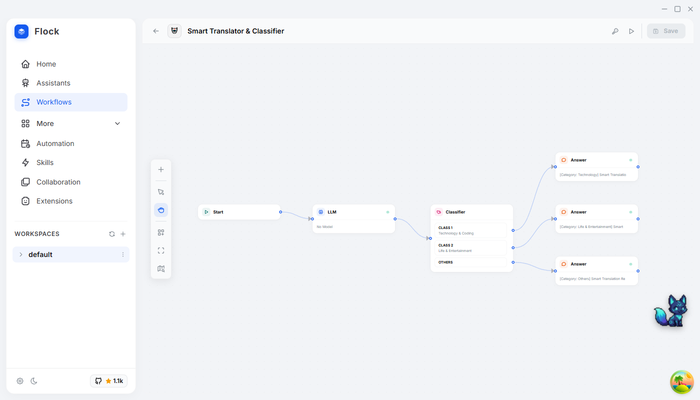
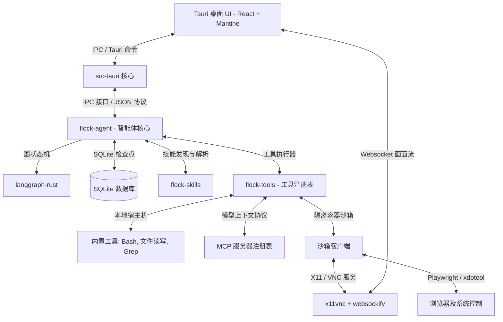

# Flock

一个基于 Rust、Tauri 和 React 构建，由 langgraph-rust 强力驱动的桌面级多智能体测试与控制台（Harness）。

**可视化工作流 | 多智能体控制台 | 内置智能体 | 安全沙箱与 VNC 实时投屏 | 跨平台 | 适配任何 API 密钥**

[English](../README.md) | 简体中文




> **注意**：本项目基于 [langgraph-rust](https://github.com/Onelevenvy/langgraph-rust) 构建，这是我个人对 LangGraph 框架 of Rust 的实现。
>
> **重构历史**：Flock 经历了从头开始的彻底重构。原始版本是一个以 Python 为基础的应用，使用 LangGraph、LangChain 和 FastAPI 作为后端。当前版本是一个原生的桌面应用，拥有 Rust 后端，并由 Tauri 提供桌面外壳 support。这次重构带来了性能、可靠性和用户体验上的显著提升。
>
> **遗留代码**：原始的 Python 代码库已保存在 `legacy/python` 分支中，以供参考。

---

## 📋 快速导航

[多智能体控制台与工作流](#-多智能体控制台与工作流--ai-智能体的可视化编排与执行) · [核心特性](#-核心特性) · [架构设计](#-架构设计) · [快速开始](#-快速开始)

---

## 🤝 多智能体控制台与工作流 — AI 智能体的可视化编排与执行

Flock 不仅仅是一个简单的 AI 聊天客户端。它是一个功能完善的 **多智能体控制台（Harness）**，完美融合了**可视化工作流编辑器**。它支持在本地或安全沙箱容器内运行 AI 智能体来读取/写入文件、执行终端命令、浏览网页、以及自动串联复杂的工作流逻辑。您能够实时监视智能体的一举一动，并拥有完全的控制权。

| 核心能力 / 功能特性 | 传统 AI 聊天客户端 | Flock (多智能体控制台 Harness) |
| :--- | :---: | :---: |
| **可视化工作流编辑器** | 无 | **有** —— 基于 ReactFlow，支持 10 种节点自由连线与步骤高亮流式执行 |
| **AI 文件读写与操作** | 限制或无 | **有** —— 内置智能体，具备完整文件系统、Grep 检索与 Glob 匹配权限 |
| **多步骤自主规划** | 无 | **有** —— 基于 LangGraph-rust 状态机，由用户审批保障安全的自主循环 |
| **定时任务自动化** | 无 | **有** —— 预置 Cron 调度系统，支持 24/7 后台自动定时运行任务 |
| **多智能体协同** | 无 | **有** —— 自动检测并统筹多智能体/助手，协同完成任务 |
| **免费且完全开源** | 极少 | **是** —— 基于 Rust & Tauri 构建，完全免费且支持极佳的性能扩展 |

---

## 🌟 核心特性

### 🕸️ 可视化工作流编辑器 (Visual Workflow)
* **拖拽式画布**：基于 ReactFlow 构建，通过连接智能体、逻辑控制器和脚本节点，可视化编排复杂的业务管线。
* **10 种内置节点类型**：
  * `start` 与 `answer`：工作流的输入入口与最终结果输出映射。
  * `llm` 与 `agent`：纯大模型推理节点与支持工具调用的 LangGraph 智能体节点。
  * `classifier` 与 `ifelse`：语义分类路由与多分支条件逻辑判断。
  * `code`：运行自定义 JavaScript/Python 脚本，进行任意数据转换。
  * `human`：人工干预阻断节点，用于等待人工输入确认或补充物料。
  * `plugin` 与 `parameter_extractor`：内置/自定义工具插件节点与结构化数据提取器。
* **工作流版本管理与历史追踪**：支持多版本工作流的生命周期管理，并记录执行过程中的状态历史，方便回溯与调试。

### 👥 人机协同与安全交互 (Human-in-the-Loop)
* **交互式工具审批门禁**：对敏感或带有风险的工具（如执行终端命令、修改系统配置、写文件）进行严格权限管理，在智能体执行前必须经由用户显式批准，支持随时预览 and 拦截。
* **VNC 屏幕接管**：在 Agent 执行自动化浏览器或桌面模拟卡住（如遇到复杂验证码或敏感支付环境）时，用户可直接在桌面客户端一键接管虚拟桌面的鼠标和键盘，实现无缝的人机协助。
* **工作流人工断点 (`human` 节点)**：允许在可视化工作流的任意环节中插入人工干预阻断器，用于向用户请求确认、表单填写或者手动分支决策，然后再继续恢复执行。

### 🌐 网页自动化与计算机控制 (Computer Use)
* **Playwright 网页操作**：在安全沙箱内通过 Playwright 驱动进行导航、点击、表单填写，突破反爬逻辑。
* **计算机控制 (Computer Use)**：通过 `xdotool` 操控虚拟桌面的鼠标和键盘。智能体实时观察屏幕帧缓冲区输出并分析截图，形成“截图 -> 规划操作 -> 反馈”的视觉闭环。

### 🤖 内置智能体 — 零配置，开箱即用
* **无需繁琐安装**：不需额外在终端安装各种 CLI 工具。贴入任何 API 密钥（OpenAI, Gemini, Anthropic Claude, AWS Bedrock, 或本地 Ollama/LM Studio）即可立即使用。
* **技能系统扩展**：支持 YAML frontmatter 的 Markdown 提示词技能模板，支持文件系统监控及热重载。

### 🔒 安全沙箱运行环境
* **隔离安全执行**：所有敏感或带有风险的命令行、代码编译任务均在独立的隔离容器中安全执行，保障宿主机系统不受损伤。
* **桌面流渲染**：通过 WebSocket 将沙箱的虚拟桌面屏幕流直接渲染至 React 客户端，全程透明可追溯。

### 🔌 MCP 协议与定时任务
* **MCP 支持**：只需接入一次本地或远程 MCP 服务器，所有助理及工作流即可自动继承新暴露出来的所有 schemas 工具。
* **定时自动化任务**：支持标准 cron 语法，常用于定时抓取信息、数据汇总、定期清理或生成日报。

---

## 🏗️ 架构设计



### 模块结构说明

| 模块 (Crate) | 目录位置 | 用途描述 |
|-------|-----------|---------|
| `flock-core` | `crates/flock-core` | 共享配置、SQLite 数据库模型、加密机制以及 IPC 通信底层封装。 |
| `flock-agent` | `crates/flock-agent` | 智能体主运行循环、LangGraph 状态机驱动、Checkpoint 历史持久化与长期记忆索引。 |
| `flock-workflow`| `crates/flock-workflow` | 可视化工作流节点核心逻辑实现，以及 JSON 工作流到 LangGraph AST 的编译器。 |
| `flock-tools` | `crates/flock-tools` | 本地与沙箱工具实现、沙箱生命周期管理以及 VNC WebSocket 代理桥接。 |
| `flock-skills` | `crates/flock-skills` | 系统提示词注册中心，支持变量注入、执行钩子与文件热重载。 |
| `flock-ui` | `flock-ui` | 基于 Zustand 状态管理、i18next 国际化和 ReactFlow 连线编辑器的桌面应用前端。 |

---

## ⚡ 快速开始

### 准备环境
* **Rust**: `1.77.2` 或更高版本
* **Node.js**: `18.x` 或更高版本

### 编译与本地开发

1. **克隆仓库**
   ```bash
   git clone https://github.com/Onelevenvy/flock.git
   ```

2. **安装前端依赖**
   ```bash
   cd flock-ui
   npm install
   ```

3. **以开发模式启动 Tauri 桌面端**
   ```bash
   npm run tauri dev
   ```

4. **运行 Rust 单元测试**
   ```bash
   cargo test --workspace
   ```

---

## 🗺️ 发展路线 (Roadmap)

- [x] **安全沙箱环境**：包含桌面流渲染与人工接管机制。
- [x] **可视化工作流编辑器**：基于 ReactFlow 的前端编辑器与 Rust 后端编译执行系统。
- [x] **浏览器操控工具**：沙箱环境下的 Playwright 浏览器驱动。
- [x] **Computer Use**：基于 xdotool 的 GUI 交互，配有视觉反馈循环。
- [x] **定时自动化任务**：支持类 cron 语法配置的后台自动化执行。
- [ ] **多智能体协同 (Multi-Agent)**：在工作流中编排多个角色智能体，实现协作链。
- [ ] **第三方智能体生态**：集成 Claude Code、OpenCode、OpenClaw 以及 Hermes 等生态智能体。

---

## 📄 开源协议

基于 Apache License, Version 2.0 协议开源。详情参见 [LICENSE](LICENSE)。
