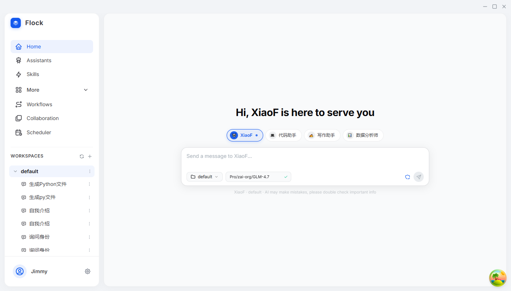
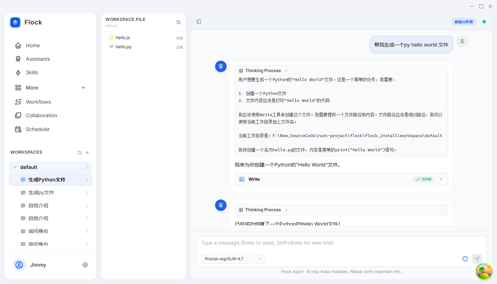
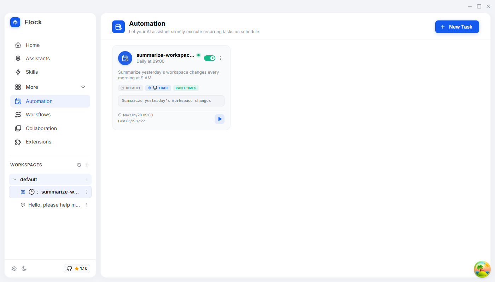
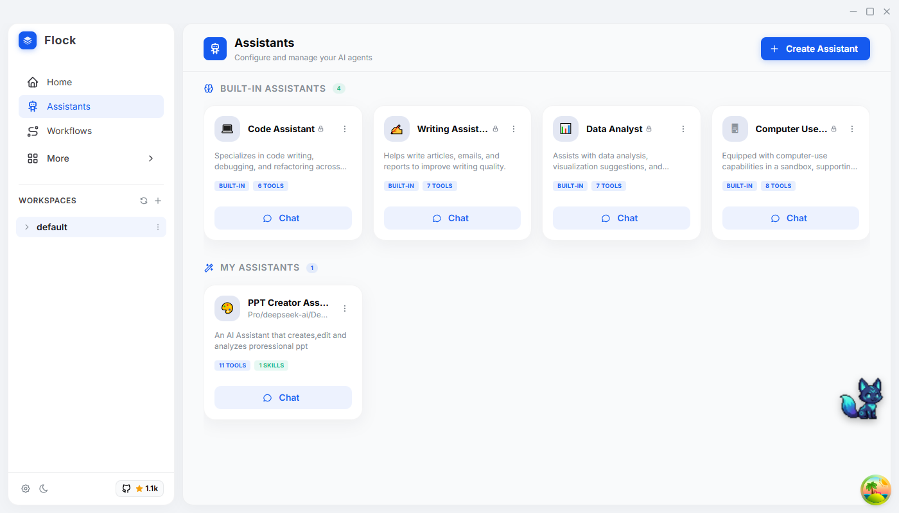

# Flock

[English](../README.md) | 简体中文

基于 Rust 和 Tauri 构建的多AI智能体（Agent）桌面应用。







> **注意**：本项目基于 [langgraph-rust](https://github.com/Onelevenvy/langgraph-rust) 构建，这是我个人对 LangGraph 框架的 Rust 实现。

> **重构历史**：Flock 经历了从头开始的彻底重构。原始版本是一个以 Python 为基础的应用，使用 LangGraph、LangChain 和 FastAPI 作为后端。当前版本是一个原生的桌面应用，拥有 Rust 后端，并由 Tauri 提供桌面外壳 support。这次重构带来了性能、可靠性和用户体验上的显著提升。

> **遗留代码**：原始的 Python 代码库已保存在 `legacy/python` 分支中，以供参考。

## 项目概述

Flock 是一款桌面应用程序，为具备工具编排能力的 AI 智能体提供交互式界面。它支持多个大语言模型（LLM）服务商，并具备丰富的内置工具、技能系统以及内存/记忆管理功能。

## 功能特性

- **多服务商支持**：兼容 OpenAI 接口、Anthropic、AWS Bedrock、Google Vertex
- **工具编排**：内置工具（读取、写入、编辑、Bash、Grep、Glob） + MCP（Model Context Protocol）服务器集成
- **技能系统**：支持带有 YAML 前言（frontmatter）的可复用提示词模板，支持热重载
- **记忆系统**：跨会话的持久化记忆（包含用户、反馈、项目、参考等类型）
- **会话管理**：基于 SQLite 持久化的对话历史记录
- **桌面 UI**：使用 React、TypeScript 和 Mantine UI 构建的现代化界面
- **国际化**：多语言支持（中文/英文）

## 架构设计

### Rust 后端

| Crate (板子) | 用途 |
|-------|---------|
| `flock-core` | 核心类型、配置、数据库、IPC 接口、密码学 |
| `flock-agent` | 智能体引擎、会话管理、工具执行、记忆系统、图编排 |
| `flock-tools` | 工具注册表、内置工具、MCP 集成、数学/天气工具 |
| `flock-skills` | 技能发现、加载、前言解析、钩子、权限管理 |
| `flock-ui/src-tauri` | Tauri 桌面应用后端 |

### 前端技术栈

- React 18 + TypeScript
- Mantine UI v8
- Zustand（状态管理）
- React Query（服务器状态同步）
- react-markdown + react-syntax-highlighter
- i18next（国际化多语言）

## 快速开始

### 前提条件

- Rust 1.77.2+
- Node.js 18+
- npm 或 yarn

### 依赖项配置

本项目依赖于 [langgraph-rs](https://github.com/Onelevenvy/langgraph-rs)。它已作为 Git 依赖直接配置在 `Cargo.toml` 中，在编译时会自动拉取。

### 编译与运行

```bash
# 克隆仓库
git clone https://github.com/Onelevenvy/flock.git
cd flock

# 安装前端依赖
cd flock-ui
npm install
cd ..

# 编译并运行桌面应用
cd flock-ui
npm run tauri dev
```

### 开发调试

```bash
# 编译 Rust 后端
cargo build

# 运行测试
cargo test

# 代码检查 (Lint)
cargo clippy --workspace

# 前端开发
cd flock-ui
npm run dev
npm run lint
```

## LangGraph 集成

本项目利用 [langgraph-rust](https://github.com/Onelevenvy/langgraph-rust) 进行智能体的图（Graph）工作流编排。LangGraph 框架提供了：

- 智能体对话的状态管理
- 工具执行流程控制
- 对话持久化的检查点（Checkpointing）机制
- 预置的智能体模式

虽然 `langgraph-rust` 并非官方的 LangGraph Rust 实现，但它提供了构建具备工具编排能力的 AI 智能体所需的核心功能。

## 发展路线 (Roadmap)

- [ ] **工作流**：用于复杂智能体编排的可视化工作流构建器
- [ ] **多智能体**：支持多个智能体协同完成任务
- [x] **定时任务**：支持类似 cron 的自动化任务执行
- [ ] **沙箱环境**：用于执行代码和命令的隔离运行环境
- [ ] **浏览器工具**：为智能体提供网页浏览与交互能力
- [ ] **扩展支持**：集成 Claude Code、OpenCode、OpenClaw、Hermes 等第三方智能体

## 开源协议

本项目采用 Apache License, Version 2.0 开源协议 - 详情请参阅 [LICENSE](LICENSE) 文件。

## 鸣谢

- [LangGraph](https://github.com/langchain-ai/langgraph) - 启发了 langgraph-rust 开发的原始 Python 框架
- [Tauri](https://tauri.app/) - 桌面应用框架
- [Mantine](https://mantine.dev/) - React UI 组件库

## 参与贡献

欢迎贡献代码！欢迎随时提交 Pull Request。

## 联系我们

如有任何问题或反馈，请在 GitHub 上创建 Issue。
